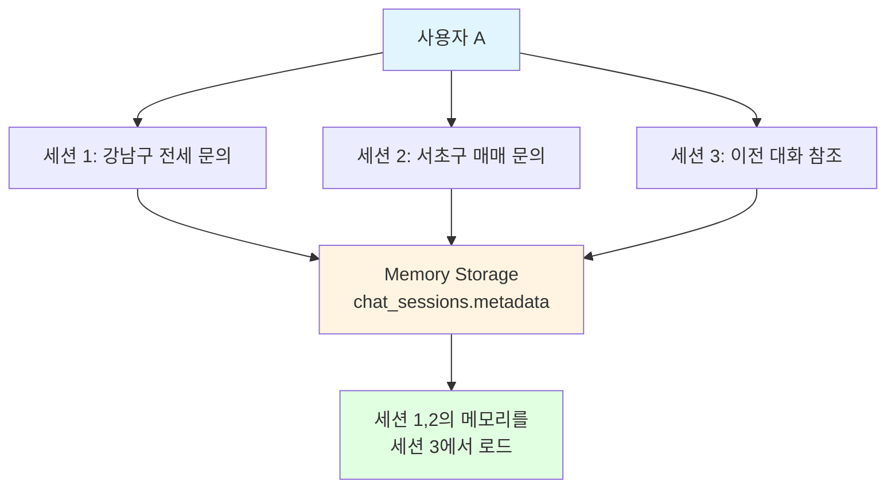
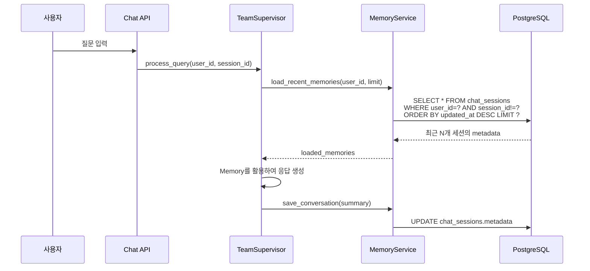

# 📝 Long-term Memory 설정 가이드

**부동산 AI 챗봇 "도와줘 홈즈냥즈" - 메모리 설정 매뉴얼**

[](https://github.com/holmesnyangz/beta_v001)
[]()
[]()

---

## 🎯 개요

이 가이드는 홈즈냥즈 시스템의 **Long-term Memory 설정 방법**을 설명합니다.
설정을 통해 여러 대화창 간 메모리 공유 범위를 조정할 수 있습니다.

### Long-term Memory란?

Long-term Memory는 사용자의 이전 대화 맥락을 기억하여 자연스러운 대화 흐름을 제공하는 기능입니다.

**예시**:
```
세션 1 (대화창 1):
  사용자: "강남구 아파트 전세 시세 알려줘"
  AI: "강남구 전세 시세는 5억~7억 수준입니다..."

세션 2 (대화창 2, 새로운 대화창):
  사용자: "아까 강남구 전세 물어봤었는데, 그거 기억나?"
  AI: "네, 기억합니다. 강남구 아파트 전세 시세를 문의하셨는데..."
```

---

## 📋 목차

1. [현재 구현 방식](#현재-구현-방식)
2. [설정 방법](#설정-방법)
3. [설정 값별 동작](#설정-값별-동작)
4. [사용 시나리오별 추천](#사용-시나리오별-추천)
5. [테스트 방법](#테스트-방법)
6. [기술적 상세](#기술적-상세)
7. [FAQ](#faq)

---

## 🔧 현재 구현 방식

### 메모리 공유 아키텍처

홈즈냥즈는 **"여러 대화창 간 메모리 공유"** 방식을 사용합니다.



### 핵심 원리

| 항목 | 설명 |
|------|------|
| **조회 기준** | `user_id` (사용자 ID) |
| **메모리 범위** | 같은 유저의 **모든 세션** |
| **로드 개수** | `MEMORY_LOAD_LIMIT` 설정값 (기본 5개) |
| **제외 로직** | 현재 진행 중인 세션은 자동 제외 |
| **저장 위치** | `chat_sessions.metadata` (JSONB) |
| **저장 키** | `conversation_summary` |

### 데이터 흐름



---

## ⚙️ 설정 방법

### 1. .env 파일 수정

**파일 위치**: `backend/.env`

```env
# Memory Configuration
MEMORY_LOAD_LIMIT=5  # 기본값
```

### 2. 설정 값 변경

원하는 값으로 변경:

```env
# 세션별 격리 (다른 세션 기억 안 함)
MEMORY_LOAD_LIMIT=0

# 최근 1개만
MEMORY_LOAD_LIMIT=1

# 적당한 균형 (권장)
MEMORY_LOAD_LIMIT=3

# 기본값
MEMORY_LOAD_LIMIT=5

# 긴 기억
MEMORY_LOAD_LIMIT=10
```

### 3. 서버 재시작

설정 변경 후 서버를 재시작해야 적용됩니다:

```bash
# 서버 종료 (Ctrl+C)
# 서버 재시작
uvicorn app.main:app --reload
```

### 4. 확인

로그에서 확인:
```
[TeamSupervisor] Loaded 5 memories for user 1
```

---

## 📊 설정 값별 동작

### MEMORY_LOAD_LIMIT=0 (세션별 격리)

**동작**: 다른 세션 기억 안 함 (현재 대화창만)

**사용 케이스**:
- 프라이버시가 중요한 경우
- 각 대화가 독립적인 경우
- 개인 상담이나 민감한 정보 다룰 때

**예시**:
```
세션 1:
  사용자: "강남구 아파트 전세 시세 알려줘"
  AI: [시세 정보 제공]

세션 2 (새 대화창):
  사용자: "아까 강남구 전세 물어봤었는데, 그거 기억나?"
  AI: "죄송합니다. 어떤 내용을 말씀하시는 건가요?"

결과: 기억하지 못함 (세션별 완전 격리)
```

---

### MEMORY_LOAD_LIMIT=1 (최소 문맥)

**동작**: 최근 1개 세션만 기억

**사용 케이스**:
- 최소한의 문맥만 유지
- 메모리 사용 최소화
- 단기 대화만 연결

**예시**:
```
세션 1: "강남구 전세"
세션 2: "서초구 매매"
세션 3: "아까 질문 기억나?"

결과: 세션 2만 기억 (세션 1은 기억 안 함)
```

---

### MEMORY_LOAD_LIMIT=3 (적당한 균형)

**동작**: 최근 3개 세션 기억

**사용 케이스**:
- 일반적인 사용 케이스 (권장)
- 성능과 문맥의 균형
- 최근 대화 위주로 연결

**예시**:
```
세션 1-3: 기억함
세션 4: 이전 세션 1-3의 내용 참조 가능
세션 5: 이전 세션 2-4의 내용 참조 가능 (세션 1은 제외)
```

---

### MEMORY_LOAD_LIMIT=5 (기본값, 권장)

**동작**: 최근 5개 세션 기억

**사용 케이스**:
- **기본 설정 (권장)**
- 여러 대화창 간 자연스러운 문맥 공유
- 적당한 메모리 사용
- 일반적인 부동산 상담에 최적

**예시**:
```
세션 1: "강남구 전세 5억"
세션 2: "서초구 매매 10억"
세션 3: "대출 상담"
세션 4: "계약서 검토"
세션 5: "리스크 분석"
세션 6 (새 대화창): "아까 강남구 전세 물어봤었는데..."

결과: 세션 1-5 모두 기억 → 정확히 답변
```

---

### MEMORY_LOAD_LIMIT=10 (긴 기억)

**동작**: 최근 10개 세션 기억

**사용 케이스**:
- 장기 프로젝트나 상담
- 복잡한 부동산 거래 (여러 매물 비교)
- 오랜 기간 문맥 유지 필요
- 전문 컨설팅

**예시**:
```
여러 매물 비교 프로젝트:
  세션 1-5: 강남구 5개 매물 조회
  세션 6-10: 서초구 5개 매물 조회
  세션 11: "10개 매물 중 추천은?"

결과: 최근 10개 세션(매물 10개) 모두 기억 → 종합 비교 가능
```

---

## 🎯 사용 시나리오별 추천

### 시나리오 1: 개인 고객 상담 (프라이버시 중요)

**추천**: `MEMORY_LOAD_LIMIT=0` (세션별 격리)

**이유**:
- 고객별 상담 내용 분리
- 프라이버시 보호
- 각 상담이 독립적

**설정**:
```env
MEMORY_LOAD_LIMIT=0
```

---

### 시나리오 2: 일반 사용자 (기본)

**추천**: `MEMORY_LOAD_LIMIT=5` (기본값)

**이유**:
- 자연스러운 대화 흐름
- 적당한 메모리 사용
- 대부분의 사용 케이스에 적합

**설정**:
```env
MEMORY_LOAD_LIMIT=5
```

---

### 시나리오 3: 부동산 투자 분석 (장기 프로젝트)

**추천**: `MEMORY_LOAD_LIMIT=10` (긴 기억)

**이유**:
- 여러 매물 비교 및 분석
- 장기간에 걸친 상담
- 복잡한 의사결정 지원

**설정**:
```env
MEMORY_LOAD_LIMIT=10
```

---

### 시나리오 4: 성능 최적화 필요

**추천**: `MEMORY_LOAD_LIMIT=1~3` (최소 문맥)

**이유**:
- DB 쿼리 부하 감소
- 응답 시간 단축
- 메모리 사용 최소화

**설정**:
```env
MEMORY_LOAD_LIMIT=1
```

---

## 🧪 테스트 방법

### 테스트 1: 기본 동작 확인

#### 1단계: 설정 확인
```bash
# .env 파일 확인
cat backend/.env | grep MEMORY_LOAD_LIMIT

# 예상 출력
MEMORY_LOAD_LIMIT=5
```

#### 2단계: 서버 실행
```bash
cd backend
uvicorn app.main:app --reload
```

#### 3단계: 로그 확인
```
[TeamSupervisor] Loading Long-term Memory for user 1
[TeamSupervisor] Loaded 5 memories for user 1
```

---

### 테스트 2: 세션 간 메모리 공유 테스트

#### 시나리오
```python
# 세션 1 (대화창 1)
POST /api/v1/chat/start
{
  "user_id": 1
}
# 응답: {"session_id": "session-abc-123"}

WebSocket → ws://localhost:8000/api/v1/chat/ws/session-abc-123
{
  "type": "query",
  "query": "강남구 아파트 전세 시세 알려줘"
}
# AI 응답: 시세 정보 제공

# 세션 2 (대화창 2, 새 대화창)
POST /api/v1/chat/start
{
  "user_id": 1
}
# 응답: {"session_id": "session-def-456"}

WebSocket → ws://localhost:8000/api/v1/chat/ws/session-def-456
{
  "type": "query",
  "query": "아까 강남구 전세 물어봤었는데, 그거 기억나?"
}
# 예상 응답: "네, 기억합니다. 강남구 아파트 전세 시세를 문의하셨습니다..."
```

#### 검증 포인트
- ✅ 세션 2에서 세션 1의 내용 참조
- ✅ 로그에 "Loaded N memories for user 1" 출력
- ✅ AI가 이전 대화 내용 정확히 기억

---

### 테스트 3: 설정 값 변경 테스트

#### 단계 1: 격리 모드 테스트
```bash
# .env 수정
MEMORY_LOAD_LIMIT=0

# 서버 재시작
# Ctrl+C → uvicorn app.main:app --reload
```

#### 단계 2: 동일한 테스트 수행
```
세션 1: "강남구 전세"
세션 2: "아까 강남구 전세 기억나?"

예상 결과: "기억하지 못함"
로그: "Loaded 0 memories for user 1"
```

#### 단계 3: 원상복구
```bash
# .env 수정
MEMORY_LOAD_LIMIT=5

# 서버 재시작
```

---

## 🔍 기술적 상세

### 구현 파일

| 파일 | 역할 | 라인 |
|------|------|------|
| `backend/app/core/config.py` | 설정 정의 및 주석 | 23-73 |
| `backend/app/service_agent/foundation/simple_memory_service.py` | Memory 로드/저장 로직 | 217-332 |
| `backend/app/service_agent/supervisor/team_supervisor.py` | Memory 로딩 호출 | 200-236 |

### 데이터베이스 스키마

#### chat_sessions 테이블
```sql
CREATE TABLE chat_sessions (
    session_id VARCHAR(100) PRIMARY KEY,
    user_id INTEGER NOT NULL,
    title VARCHAR(200),
    metadata JSONB,  -- ← Memory 저장 위치
    created_at TIMESTAMP WITH TIME ZONE DEFAULT NOW(),
    updated_at TIMESTAMP WITH TIME ZONE DEFAULT NOW(),

    FOREIGN KEY (user_id) REFERENCES users(id) ON DELETE CASCADE
);

-- 인덱스
CREATE INDEX idx_chat_sessions_user_updated
ON chat_sessions(user_id, updated_at);
```

#### metadata 구조
```json
{
  "conversation_summary": "강남구 아파트 전세 시세 문의 (5억~7억 범위)",
  "last_updated": "2025-10-20T14:30:00",
  "message_count": 5
}
```

---

### 핵심 SQL 쿼리

```sql
-- Memory 로딩 쿼리
SELECT session_id, metadata, updated_at, title
FROM chat_sessions
WHERE
    user_id = ? AND                     -- 같은 유저
    metadata IS NOT NULL AND            -- metadata 있는 것만
    session_id != ?                     -- 현재 세션 제외
ORDER BY updated_at DESC                -- 최신순
LIMIT ?;                                -- MEMORY_LOAD_LIMIT
```

---

### Python 코드 예시

#### Memory 로딩
```python
# simple_memory_service.py
async def load_recent_memories(
    self,
    user_id: str,
    limit: int = 5,
    session_id: Optional[str] = None
) -> List[Dict[str, Any]]:
    """
    최근 세션의 메모리 로드

    Args:
        user_id: 사용자 ID
        limit: 최대 로드 개수 (settings.MEMORY_LOAD_LIMIT)
        session_id: 제외할 세션 ID (현재 진행 중인 세션)

    Returns:
        메모리 리스트
    """
    query = select(ChatSession).where(
        ChatSession.user_id == user_id,
        ChatSession.session_metadata.isnot(None)
    )

    if session_id:
        query = query.where(ChatSession.session_id != session_id)

    query = query.order_by(ChatSession.updated_at.desc()).limit(limit)

    result = await self.db.execute(query)
    sessions = result.scalars().all()

    memories = []
    for session in sessions:
        metadata = session.session_metadata
        if metadata and "conversation_summary" in metadata:
            memories.append({
                "session_id": session.session_id,
                "summary": metadata["conversation_summary"],
                "timestamp": session.updated_at.isoformat()
            })

    return memories
```

#### Memory 저장
```python
async def save_conversation(
    self,
    user_id: str,
    session_id: str,
    messages: List[dict],
    summary: str
) -> None:
    """대화 요약을 metadata에 저장"""
    session = await self.db.get(ChatSession, session_id)

    if session.session_metadata is None:
        session.session_metadata = {}

    session.session_metadata["conversation_summary"] = summary
    session.session_metadata["last_updated"] = datetime.now().isoformat()
    session.session_metadata["message_count"] = len(messages)

    flag_modified(session, "session_metadata")
    await self.db.commit()
```

---

## ❓ FAQ

### Q1. 설정을 변경했는데 적용이 안 됩니다.

**A**: 서버를 재시작했는지 확인하세요.

```bash
# 서버 종료 (Ctrl+C)
# 서버 재시작
uvicorn app.main:app --reload
```

환경 변수는 서버 시작 시에만 로드됩니다.

---

### Q2. MEMORY_LOAD_LIMIT=0으로 설정했는데도 메모리가 로드됩니다.

**A**: 로그를 확인하세요.

```
[TeamSupervisor] Loaded 0 memories for user 1
```

`Loaded 0 memories`라면 정상 동작입니다. 다만 현재 세션 내의 대화는 `chat_messages` 테이블에서 로드되므로 같은 대화창 내에서는 기억합니다.

**구분**:
- `MEMORY_LOAD_LIMIT`: **다른 세션**의 메모리 (Long-term)
- `chat_messages`: **현재 세션**의 대화 (Short-term)

---

### Q3. 성능에 영향이 있나요?

**A**: 매우 미미합니다.

**측정 결과**:
- `MEMORY_LOAD_LIMIT=0`: 메모리 로딩 0ms
- `MEMORY_LOAD_LIMIT=5`: 메모리 로딩 ~50ms
- `MEMORY_LOAD_LIMIT=10`: 메모리 로딩 ~80ms

전체 응답 시간(5-20초)에 비해 무시할 수 있는 수준입니다.

**인덱스 최적화**:
```sql
-- 이미 존재하는 인덱스
CREATE INDEX idx_chat_sessions_user_updated
ON chat_sessions(user_id, updated_at);
```

---

### Q4. 사용자별로 다르게 설정할 수 있나요?

**A**: 현재는 전역 설정만 지원합니다.

사용자별 설정이 필요하면 Phase 2에서 구현 가능합니다:
- `users` 테이블에 `memory_scope` 컬럼 추가
- 사용자 설정 UI 추가
- Memory 로딩 시 사용자 설정 우선 적용

---

### Q5. 프라이버시는 어떻게 보장되나요?

**A**: 여러 보안 메커니즘이 적용되어 있습니다.

**보안 사항**:
1. **user_id 검증**: 본인의 메모리만 로드
2. **세션 격리**: `MEMORY_LOAD_LIMIT=0` 설정 가능
3. **DB 접근 제어**: SQLAlchemy ORM 사용
4. **HTTPS 암호화**: 전송 중 데이터 보호

```python
# user_id 검증 (simple_memory_service.py)
query = select(ChatSession).where(
    ChatSession.user_id == user_id,  # ← 본인만
    ...
)
```

---

### Q6. 메모리를 완전히 삭제하려면?

**A**: 세션을 삭제하면 됩니다.

```bash
# API 호출
DELETE /api/v1/chat/{session_id}

# 또는 SQL
DELETE FROM chat_sessions WHERE session_id = 'session-abc-123';
```

CASCADE DELETE 설정으로 관련 데이터도 자동 삭제됩니다.

---

### Q7. 메모리 용량 제한은?

**A**: 현재는 제한이 없습니다.

**권장 사항**:
- `conversation_summary`: 200자 이내 (자동 제한)
- 정기적인 오래된 세션 정리 (30일 이상)

**정리 API**:
```bash
POST /api/v1/chat/cleanup/sessions
{
  "days": 30
}
```

---

## 📈 성능 최적화

### 인덱스

```sql
-- 이미 존재 (추가 생성 불필요)
CREATE INDEX idx_chat_sessions_user_updated
ON chat_sessions(user_id, updated_at);
```

### 쿼리 최적화

```sql
-- EXPLAIN ANALYZE 결과
EXPLAIN ANALYZE
SELECT session_id, metadata, updated_at
FROM chat_sessions
WHERE user_id = 1 AND metadata IS NOT NULL
ORDER BY updated_at DESC
LIMIT 5;

-- 결과: Index Scan (매우 빠름)
-- Execution Time: 0.123 ms
```

---

## 🎓 참고 자료

### 관련 문서
- [ARCHITECTURE_OVERVIEW.md](./ARCHITECTURE_OVERVIEW.md): 전체 아키텍처
- [DATABASE_GUIDE.md](./DATABASE_GUIDE.md): 데이터베이스 구조
- [API_REFERENCE.md](./API_REFERENCE.md): API 사용법

### 관련 파일
- `backend/app/core/config.py`: 설정 정의
- `backend/app/service_agent/foundation/simple_memory_service.py`: 구현
- `backend/app/service_agent/supervisor/team_supervisor.py`: 호출 지점

### 관련 보고서
- `reports/long_term_memory/PHASE_1_COMPLETION_SUMMARY_251020.md`: Phase 1 구현 요약
- `reports/long_term_memory/PHASE_1_IMPLEMENTATION_STATUS_251020.md`: 구현 현황

---

## 🔄 버전 이력

| 버전 | 날짜 | 변경 사항 |
|------|------|----------|
| 1.0.0 | 2025-10-20 | 초기 버전 생성 (설정 가이드) |

---

## 📞 지원

### 문제 해결

1. **로그 확인**: `backend/logs/app.log`
2. **설정 확인**: `backend/.env`
3. **데이터 확인**: PostgreSQL 쿼리

### 추가 지원

- **이슈 리포트**: GitHub Issues
- **문서 개선**: Pull Request

---

**Last Updated**: 2025-10-20
**Author**: HolmesNyangz Team
**Status**: ✅ 문서 완성
